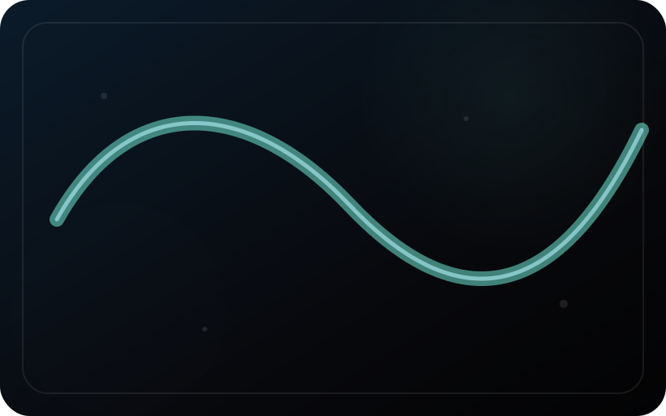
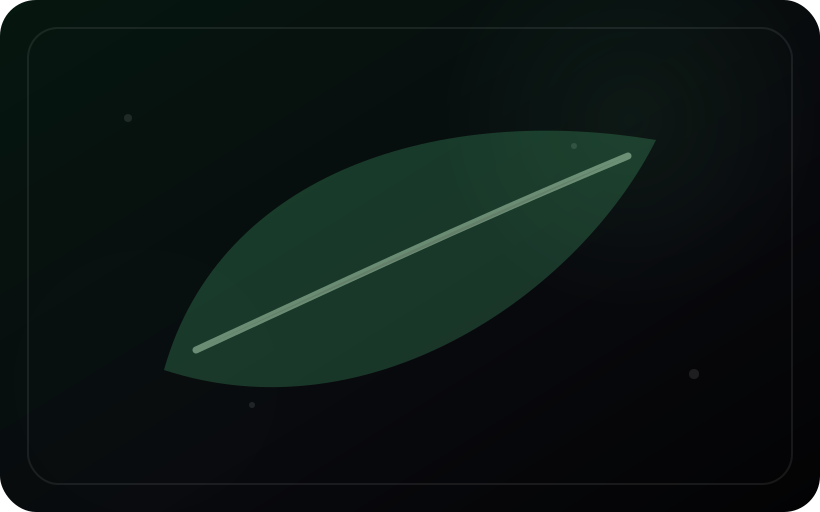
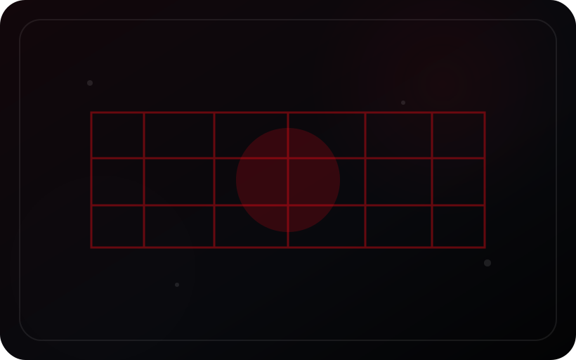
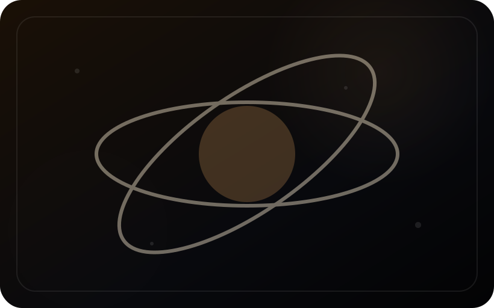
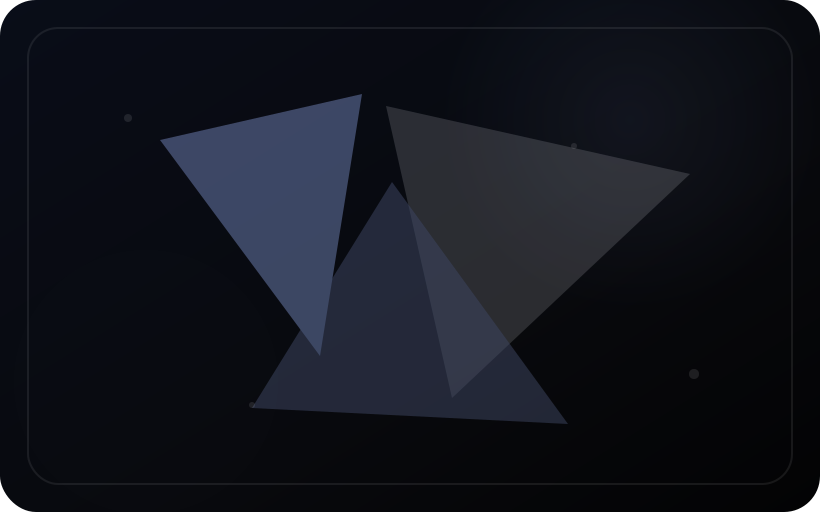
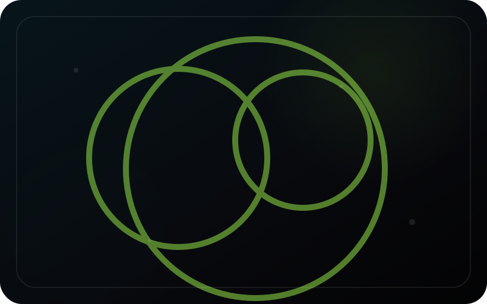
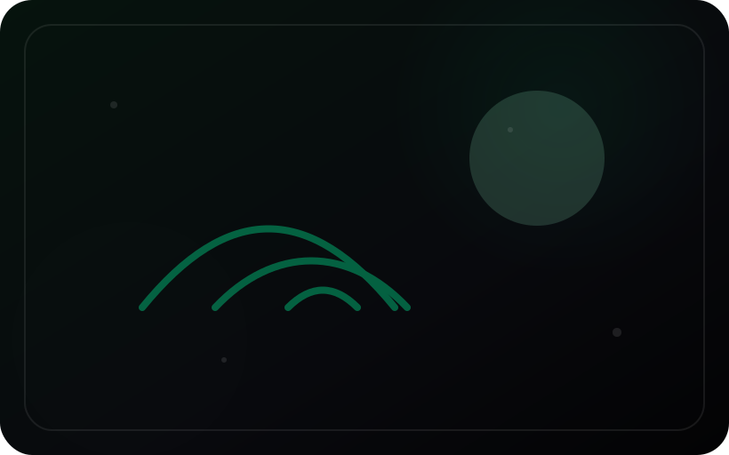
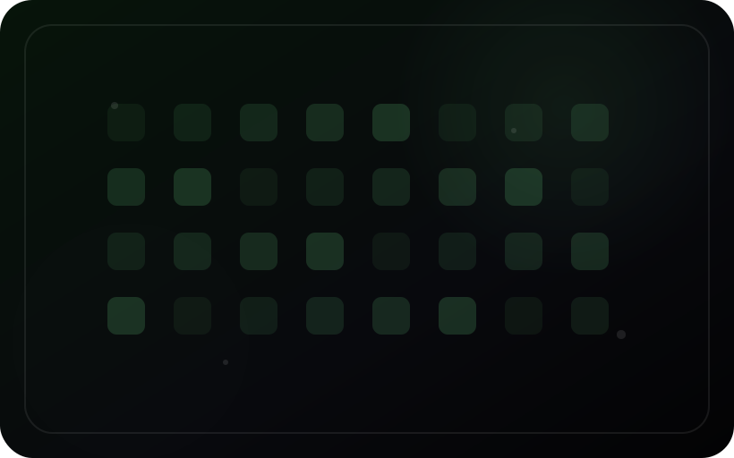

<div align="center">

# Streamfolio

**Plateforme de streaming vidéo de démonstration, inspirée des expériences Netflix-like, développée pour portfolio.**

[](https://github.com/alescis-wuin/streamfolio/actions/workflows/ci.yml)


</div>

---

## Aperçu


### Captures d'écran

#### Desktop

<table>
  <tr>
    <td colspan="2">
      <strong>Accueil — hero et rails principaux</strong><br>
      
    </td>
  </tr>
  <tr>
    <td width="50%">
      <strong>Accueil — navigation catalogue</strong><br>
      
    </td>
    <td width="50%">
      <strong>Accueil — rails étendus</strong><br>
      
    </td>
  </tr>
  <tr>
    <td width="50%">
      <strong>Fiche film</strong><br>
      
    </td>
    <td width="50%">
      <strong>Lecteur vidéo</strong><br>
      
    </td>
  </tr>
</table>

<details>
<summary><strong>Voir le parcours desktop complet</strong></summary>

<table>
  <tr>
    <td width="50%">
      <strong>Connexion</strong><br>
      
    </td>
    <td width="50%">
      <strong>Recherche botanical</strong><br>
      
    </td>
  </tr>
  <tr>
    <td width="50%">
      <strong>Résultats de recherche</strong><br>
      
    </td>
    <td width="50%">
      <strong>Fiche série</strong><br>
      
    </td>
  </tr>
  <tr>
    <td width="50%">
      <strong>Ma liste</strong><br>
      
    </td>
    <td width="50%">
      <strong>Page lecture</strong><br>
      
    </td>
  </tr>
  <tr>
    <td width="50%">
      <strong>Lecture — vue secondaire</strong><br>
      
    </td>
    <td width="50%">
      <strong>Lecteur isolé</strong><br>
      
    </td>
  </tr>
</table>

</details>

#### Mobile

<table>
  <tr>
    <td width="33%">
      <strong>Mobile — vue 1</strong><br>
      
    </td>
    <td width="33%">
      <strong>Mobile — vue 2</strong><br>
      
    </td>
    <td width="33%">
      <strong>Mobile — vue 3</strong><br>
      
    </td>
  </tr>
</table>

<details>
<summary><strong>Voir aussi les affiches SVG du catalogue</strong></summary>

<table>
  <tr>
    <td width="25%"><strong>Aurora Drift</strong><br></td>
    <td width="25%"><strong>Botanical Cities</strong><br></td>
    <td width="25%"><strong>Silent Protocol</strong><br></td>
    <td width="25%"><strong>Kitchen Orbit</strong><br></td>
  </tr>
  <tr>
    <td width="25%"><strong>Glass Archive</strong><br></td>
    <td width="25%"><strong>Neon Orchard</strong><br></td>
    <td width="25%"><strong>Signal Garden</strong><br></td>
    <td width="25%"><strong>Pixel Greenhouse</strong><br></td>
  </tr>
</table>

</details>

## Objectif

Streamfolio démontre la réalisation d'une application complète de type streaming : authentification, catalogue films/séries, watchlist, progression de lecture, fiches détail, lecteur vidéo HTML5, streaming MP4 progressif, HLS local, administration média, upload et transcodage FFmpeg.

Le projet privilégie une architecture simple à lancer et à évaluer : backend Spring Boot, interface PWA responsive sans build frontend obligatoire, profil H2 jetable, profil PostgreSQL persistant et médias de démonstration libres d'utilisation.

## Fonctionnalités principales

| Domaine | Fonctionnalités |
|---|---|
| Authentification | Spring Security, BCrypt, cookie `HttpOnly`, `SameSite=Strict`, logout serveur, session courte |
| Rôles | `USER` pour la consultation, `ADMIN` pour les routes d'administration média |
| Catalogue | Films, séries, genres, recherche, filtres, rails horizontaux, hero immersif |
| UX streaming | Fiches détail, progression, watchlist, reprise de lecture, raccourcis clavier |
| Vidéo | Lecteur HTML5, sous-titres WebVTT, HTTP Range, fallback MP4 progressif |
| HLS local | Génération FFmpeg `360p`, `720p`, `1080p`, playlist master, hls.js, thumbnails timeline |
| Admin média | Liste, filtres, upload, métadonnées, miniatures, link/unlink, transcodage, suivi des jobs |
| Persistance | H2 par défaut, PostgreSQL via profil dédié, Flyway pour les migrations |
| Qualité | Tests Maven, tests sécurité, tests streaming/admin, smoke tests, CI GitHub Actions |
| Portfolio | Documentation, captures, GIF, Docker, Git LFS, validation automatisée |

## Stack

| Couche | Technologies |
|---|---|
| Backend | Java 21, Spring Boot 4.1, Spring MVC, Spring Security, Spring Data JPA, Bean Validation |
| Sécurité | BCrypt, cookie de session `HttpOnly`, `SameSite=Strict`, CSRF sur mutations, rôles applicatifs |
| Base de données | H2 en mémoire par défaut, PostgreSQL + Flyway avec profils `postgres`/`docker` |
| Frontend | HTML, CSS, JavaScript natif, PWA, Service Worker |
| Streaming | MP4 progressif, HTTP Range, WebVTT, HLS local, hls.js avec fallback MP4 |
| Média | Classpath par défaut, stockage local `backend/data/media`, Git LFS pour les fichiers lourds |
| Outillage | Maven, Docker, Docker Compose, Bash, Playwright, FFmpeg/ffprobe |
| CI | GitHub Actions : validation complète, tests E2E, logs en artifact, build Docker |

## Structure du projet

```text
backend/                     API Spring Boot + frontend PWA servi en statique
backend/src/main/java/       Code Java backend
backend/src/main/resources/  Configuration, UI, médias et données de démonstration
backend/src/test/            Tests backend
scripts/                     Scripts Linux/Windows, smoke tests, validation, HLS
tests/e2e/                   Parcours Playwright
docs/                        Architecture, roadmap, captures, validation, persistance
.github/workflows/           CI GitHub Actions
```

## Démarrage rapide

### Prérequis

| Outil | Usage |
|---|---|
| Java 21+ | Exécution backend |
| Maven 3.9+ | Build et tests |
| Node.js + npm | Tests E2E Playwright |
| `jq` | Smoke tests HTTP |
| Docker / Docker Compose | Lancement conteneurisé optionnel |
| FFmpeg / ffprobe | Extraction métadonnées, miniatures, transcodage HLS |
| Git LFS | Récupération des médias versionnés |

```bash
git lfs install
git lfs pull
```

### Lancement développement HTTP

```bash
cd backend
SPRING_PROFILES_ACTIVE=dev mvn spring-boot:run
```

### Lancement local avec médias fichiers

```bash
bash scripts/prepare-local-media.sh backend/data/media
cd backend
SPRING_PROFILES_ACTIVE=local mvn spring-boot:run
```

### Lancement PostgreSQL local

```bash
docker compose up -d postgres
cd backend
SPRING_PROFILES_ACTIVE=postgres mvn spring-boot:run
```

### Lancement distant derrière HTTPS

La variable correcte est `STREAMFOLIO_COOKIE_SECURE`. Derrière HTTPS, activer explicitement :

```bash
SPRING_PROFILES_ACTIVE=distant,postgres \
STREAMFOLIO_COOKIE_SECURE=true \
mvn -f backend/pom.xml spring-boot:run
```

`distant` active aussi `server.forward-headers-strategy=framework` pour fonctionner proprement derrière un reverse proxy.

### Lancement Docker

```bash
docker compose up --build
```

## Profils applicatifs

| Profil | Usage | Cookie `Secure` | Stockage média |
|---|---|---:|---|
| défaut | Démo rapide H2/classpath | configurable, défaut `false` | classpath |
| `dev` | Développement HTTP + H2 console | `false` par défaut | classpath |
| `local` | Démo locale avec fichiers dans `STREAMFOLIO_MEDIA_ROOT` | `false` par défaut | local |
| `local-media` | Alias historique du mode média local | `false` par défaut | local |
| `postgres` | Base persistante PostgreSQL + Flyway | hérite du profil actif | local |
| `docker` | Compose avec PostgreSQL | configurable | local conteneur |
| `distant` | HTTPS / reverse proxy | `true` par défaut | hérite du profil actif |

## Validation

Commande principale depuis la racine :

```bash
bash scripts/validate.sh
```

Cette commande vérifie notamment : dépôt propre, scripts, JavaScript, Python, `mvn clean test`, packaging Maven, démarrage classpath, smoke test, préparation local-media, démarrage local-media et smoke test local-media.

Tests E2E :

```bash
npm install
npx playwright install chromium
npm run test:e2e
```

## Streaming local et HLS

Mode par défaut : médias servis depuis le classpath.

Mode local : médias lus depuis `backend/data/media` ou `STREAMFOLIO_MEDIA_ROOT`.

```bash
bash scripts/prepare-local-media.sh backend/data/media
```

Le pipeline admin peut lancer un transcodage HLS local via FFmpeg. Les sorties attendues sont :

```text
backend/data/media/hls/{videoId}/master.m3u8
backend/data/media/hls/{videoId}/360p/playlist.m3u8
backend/data/media/hls/{videoId}/720p/playlist.m3u8
backend/data/media/hls/{videoId}/1080p/playlist.m3u8
backend/data/media/thumbnails/{videoId}/manifest.json
```

Le lecteur choisit HLS quand `master.m3u8` existe, sinon il retombe automatiquement sur le MP4 progressif.

## PostgreSQL, rôles et sessions

PostgreSQL persiste les données métier : utilisateurs, rôles, catalogue, médias, jobs, watchlist et progression. Les rôles sont stockés dans `user_account_roles`.

Les sessions applicatives actuelles sont différentes : le jeton de session est conservé dans le processus backend. Un redémarrage invalide donc les connexions ouvertes, mais ne supprime pas les comptes, rôles, vidéos, progressions ou jobs stockés dans PostgreSQL. Pour une cible production, l'étape suivante serait Spring Session JDBC/Redis ou un mécanisme équivalent.

## Médias et Git LFS

Les médias lourds sont suivis avec Git LFS via `.gitattributes`.

| Zone | Statut |
|---|---|
| `backend/src/main/resources/media/*.mp4` | Suivi LFS |
| `docs/record/*.mp4`, `*.mkv`, `*.gif`, `*.webm` | Suivi LFS |
| `docs/screenshots/*.png`, `*.gif`, `*.mp4`, `*.webm` | Suivi LFS |
| `backend/data/media/**` | Stockage local généré, non versionné |

## Qualité technique

| Contrôle | Couverture actuelle |
|---|---|
| Tests backend | Chargement contexte, auth, sécurité, catalogue, streaming, stockage média, FFmpeg/transcodage, admin |
| Smoke tests | Health, login, cookie, `/api/me`, sections, genres, catalogue, streaming Range, logout |
| Sécurité | Endpoints vidéo protégés, admin réservé au rôle `ADMIN`, cookie `HttpOnly`, absence de jeton dans la réponse login |
| CI | Validation complète + Playwright + build Docker |
| Dépôt | `.gitignore`, `.dockerignore`, `.gitattributes`, Git LFS, contrôle des fichiers générés |

## Documentation

| Document | Rôle |
|---|---|
| [`docs/02-architecture.md`](docs/02-architecture.md) | Architecture générale |
| [`docs/04-roadmap.md`](docs/04-roadmap.md) | Roadmap fonctionnelle |
| [`docs/06-stockage-media.md`](docs/06-stockage-media.md) | Mode local, HLS et FFmpeg |
| [`docs/06-verification.md`](docs/06-verification.md) | Validation locale et CI |
| [`docs/08-postgresql-persistence.md`](docs/08-postgresql-persistence.md) | Persistance PostgreSQL |
| [`docs/validation-checklist.md`](docs/validation-checklist.md) | Checklist de passage de phase |
| [`docs/screenshots/README.md`](docs/screenshots/README.md) | Arborescence des captures et GIF |

## Limites assumées

> [!IMPORTANT]
> Cette version est conçue pour un portfolio, pas pour une production réelle.

- Compte utilisateur de démonstration préchargé.
- Sessions applicatives en mémoire, donc connexions invalidées au redémarrage backend.
- Cookie `Secure` désactivé en local HTTP, activable via `STREAMFOLIO_COOKIE_SECURE=true` derrière HTTPS.
- H2 jetable par défaut ; PostgreSQL recommandé pour conserver les données.
- Pas de DRM.
- Adaptateur MinIO/S3 préparé mais pas encore branché comme stockage objet complet.
- Pas de CDN.
- Pipeline FFmpeg local, adapté à une démo avancée mais pas à une file distribuée de production.

## Historique extrait du CHANGELOG

### V1.1 — refonte UI streaming premium

Backend Java/Spring Boot, interface PWA responsive, catalogue films/séries, lecteur vidéo, progression, recherche, filtres par genre et liste personnelle.

### V2 — UI plus épurée

Cartes silencieuses avec titre superposé, logo seul, profil pour déconnexion, boutons textuels plus lisibles et carrousels avec flèches conditionnelles.

### V3 — corrections rails, miniatures et aperçu au clic

Suppression de l'aperçu au survol dans les rails, modale centrée au clic, sections rapprochées, miniatures SVG propres et cache PWA incrémenté.

### V4 — régénération des ressources et cache de développement

Procédure explicite de régénération des miniatures, reset de l'état local backend et nettoyage du cache navigateur/PWA.

### V5 — corrections scrollbars, carrousels et miniatures propres

Scrollbars globales stylisées, flèches de carrousel conditionnelles, nouvelles miniatures `posters-clean` et rafraîchissement automatique du seed.

### V6 — corrections détail et carrousels

Flèches mieux positionnées, page détail avec glassmorphisme, détail film simplifié et conservation de la liste d'épisodes uniquement pour les séries.

### V7 — navigation homogène

Accueil, Films, Séries et Ma liste partagent le même rendu : hero contextuel, section Explorer, rails horizontaux et cache session des réponses principales.

L'historique complet reste disponible dans [`CHANGELOG.md`](CHANGELOG.md).
